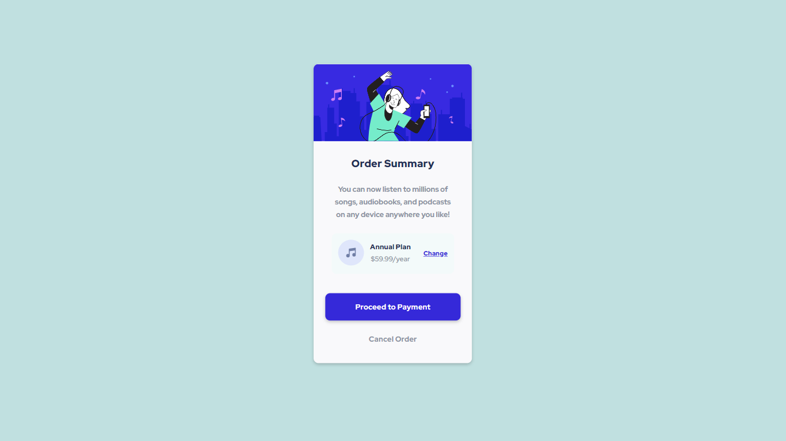

# Frontend Mentor - Order summary card solution

- Website - https://abhishekanimatron.github.io/fm-order-summary-component-main/

This is a solution to the [Order summary card challenge on Frontend Mentor](https://www.frontendmentor.io/challenges/order-summary-component-QlPmajDUj). Frontend Mentor challenges help you improve your coding skills by building realistic projects.

### Screenshot (1366x768)

### Links

- Solution URL: [Github Repository](https://github.com/abhishekanimatron/fm-order-summary-component-main/)
- Live Site URL: [Deployed Github page](https://abhishekanimatron.github.io/fm-order-summary-component-main/)

### Built with

- Semantic HTML5 markup
- CSS custom properties
- Flexbox
- Mobile-first workflow
